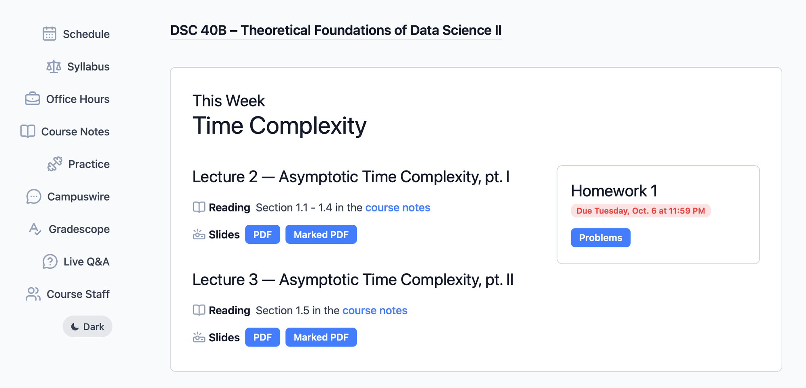
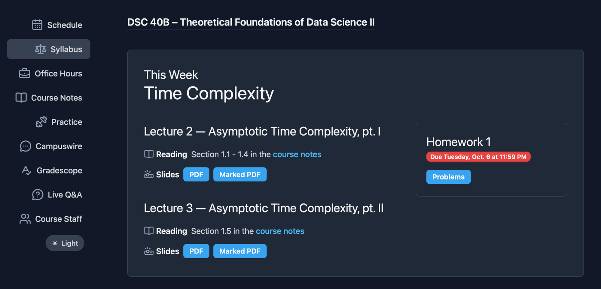

automata
========

.. image:: ../../branding/automata-lockup.svg
   :alt: automata
   :width: 320px
   :class: only-light

**Automate your course.**

Describe your assignments, lectures, and exams *once*, and automata handles the
logistics: it builds your course materials, releases them on schedule, and
generates a modern course website listing them.

         this week's lectures with links to their slides, and a homework card
         showing its due date.
   :class: screenshot only-light

         this week's lectures with links to their slides, and a homework card
         showing its due date.
   :class: screenshot only-dark

Automata cuts down on the busywork of running a course, so you can focus on teaching. It
does this in several ways:

- **Frictionless publishing**. No more clicking around a clunky content
  management system (*cough* Canvas *cough*) or editing your webpage to upload
  your slides. Simply tell automata where they are and how to make them, then
  run ``automata publish``: your slides are online. Found a typo? Fix it in
  your source file and run ``automata publish`` again -- your slides are
  updated automatically.

- **Automatic releases**. Your homework solutions are released every Tuesday at 5pm,
  but you keep forgetting to upload them? Automata can do it for you. Just run automata
  on a schedule, and all of your materials are released automatically. Nervous
  about accidentally releasing a solution early? Automata can show you exactly what
  will be released and when -- or, if you'd rather be in total control, you can disable
  automatic releases entirely.

- **Easy course setup**. Spending hours updating your course website at the
  beginning of each term? With automata, all of the important pieces of
  information are in one place. Change the date of the first lecture, for
  example, and the rest of the lectures are updated automatically -- as are
  the syllabus, the schedule on the webpage, etc.

.. admonition:: What about *agents?*

   Agents can do much of the above, but with automata they can do it quicker,
   more reliably, and with fewer tokens. To that end, automata is designed to
   with both humans and agents in mind: it includes through command-line help,
   expressive error messages, and complete documentation with examples.

Where to start
--------------

- New to automata? Start with the :doc:`guide/quickstart`.
- Want the big picture? Read :doc:`guide/concepts`.
- Looking something up? See the :doc:`reference/index`.

.. toctree::
   :maxdepth: 2
   :caption: Contents
   :hidden:

   guide/index
   reference/index
   extensions/index
   developer/index
